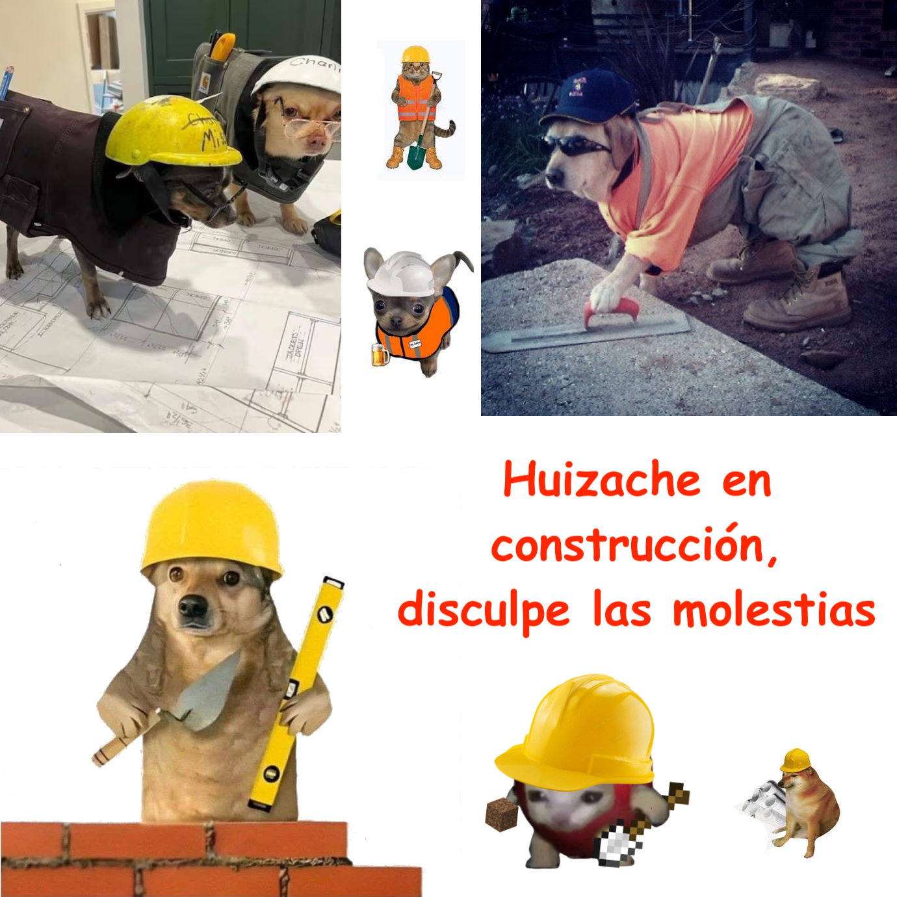

# Huizache

Repositorio con el codigo en desarrollo de mi instrumento digital personalizado para la práctica de la libre improvisación electroacústica. 

Forma parte de la documentación y enfoque abierto de mi tesis _**Huizache: diseño e implementación de un instrumento digital para la improvisación libre**_ (también en desarrollo).

Se planeta el diseño de una interfaz modular estable basada en el trabajo de Sam Pluta, con módulos iniciales de sampleo, síntesis aditiva y clasificación de grabaciones de campo en un espacio bidimensional según sus caraterísticas tímbricas. 

.

.

.

.

.

.

.

**¿Qué culpa tiene el huizache de haber nacido en el llano?**

